I received B.A. degree from School of Internet of Things Engineering at Jiangnan University, in 2015. For two years up to 2018, I studied as a Master student in Jiangsu Provincial Engineering Laboratory of Pattern Recognition and Computational Intelligence, Jiangnan University. I received my Ph.D. degree at Jiangsu Provincial Engineering Laboratory of Pattern Recognition and Computational Intelligence, [Jiangnan University](http://www.jiangnan.edu.cn/), in December of 2021, supervised by [Pro. Xiao-Jun Wu](http://ai.jiangnan.edu.cn/info/1013/1500.htm). 

I am currently a Lecturer ([home page](http://ai.jiangnan.edu.cn/info/1081/2936.htm)) at the School of Artificial Intelligence and Computer Science and the International Joint Laboratory on Artificial Intelligence of Jiangsu Province, Jiangnan University, Wuxi, China. My research interests include computer vision, multi-modal image fusion, multi-modal super-resolution and multi-modal detection/tracking. 

I have published several scientific papers (7 highly cited papers, 1 hot paper), including IEEE TPAMI, IEEE TIP, IJCV, Information Fusion etc. I achieved top tracking performance in several competitions, including the VOT2020 RGBT challenge (ECCV20), VOT2021 RGBD challenge (ICCV21) and Anti-UAV challenge (ICCV21). I have been chosen among [the World's Top 2% Scientists ranking in the single recent year dataset published by Stanford University (2021, 2022, 2023)](https://elsevier.digitalcommonsdata.com/datasets/btchxktzyw/7).

**Current research:**
+ Computer vision  
+ Multi-modal FUSION, SUPER-RESOLUTION  
+ Multi-modal DETECTION, TRACKING 

**Email:**  
+ lihui.cv@jiangnan.edu.cn  
+ hui_li_jnu@163.com  

---
# Github Infor
<!-- 
 

 -->
 

<!-- height="165" -->
<!-- 

    
    
    

 -->

---
# Students

Mater students (Co-advised with [Prof. Xiaoning Song](https://ai.jiangnan.edu.cn/info/1013/1507.htm) and [Prof. Xiaoqing Luo](https://ai.jiangnan.edu.cn/info/1013/3246.htm))  
- [Yongbiao Xiao](https://github.com/draymondbiao)  
- [Tianyu Shen](https://github.com/stywmy)  
- [Haolong Ma](https://github.com/zipper112)  
- Congcong Bian  
- [Zhiming Meng](https://github.com/ZhimingMeng)  
- Jiancong Xu  
- Sheng Huang  
- Ziyang Liu  
- Zhijia Din  
- Jingwen Tan  

---
# Publications

## Journal papers

   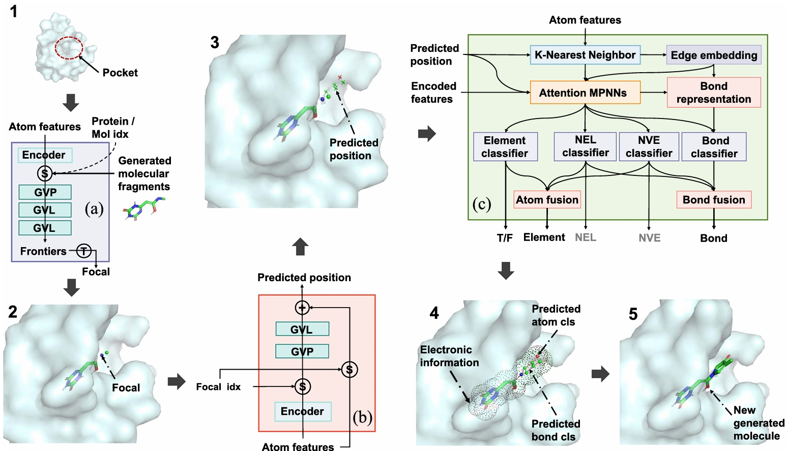
   

      <b>25. APMG: 3D Molecule Generation Driven by Atomic Chemical Properties</b> 
      Yang Hua, Zhenhua Feng, Xiaoning Song*, <strong><b>Hui Li</b></strong>, Tianyang Xu, Xiao-Jun Wu, Dong-Jun Yu  
      IEEE/ACM Transactions on Computational Biology and Bioinformatics (<b>TCBB</b>, IF: 3.6), Volume: 21, Issue: 6, Nov.-Dec. 2024.  
      [<a href="https://doi.org/10.1109/TCBB.2024.3457807">paper</a>][arxiv][code]
   

 

   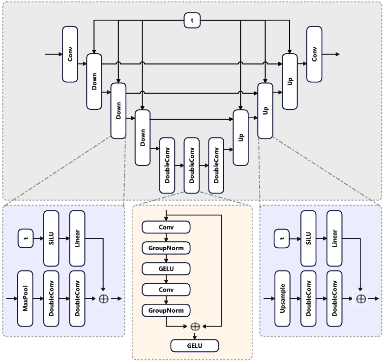
   

      <b>24. UUD-Fusion: An unsupervised universal image fusion approach via generative diffusion model</b> 
      Xiangxiang Wang, Lixing Fang, Junli Zhao, Zhenkuan Pan, <strong><b>Hui Li</b></strong>, Yi Li*  
      Computer Vision and Image Understanding (<b>CVIU</b>, IF: 4.2997), Volume: 249, December 2024, 104218.  
      [<a href="https://doi.org/10.1016/j.cviu.2024.104218">paper</a>][arxiv][<a href="https://github.com/xiangxiang-wang/UUD-Fusion">code</a>]
   

 

   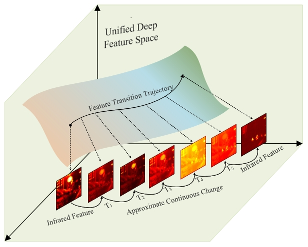
   

      <b>23. Conti-Fuse: A Novel Continuous Decomposition-based Fusion Framework for Infrared and Visible Images</b> 
      <strong><b>Hui Li*</b></strong>, Haolong Ma, Chunyang Cheng, Zhongwei Shen, Xiaoning Song, Xiao-Jun Wu 
      Information Fusion (<b>InfFus</b>, IF: 14.7007), Volume 117, May 2025, 102839.  
      [<a href="https://doi.org/10.1016/j.inffus.2024.102839">paper</a>][<a href="https://arxiv.org/abs/2406.04689">arxiv</a>][<a href="https://github.com/zipper112/Conti-Fuse">code</a>]
   

 

   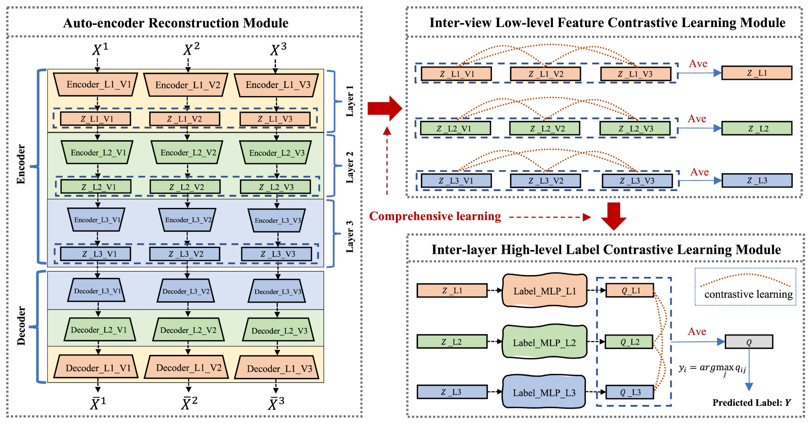
   

      <b>22. Multi-layer multi-level comprehensive learning for deep multi-view clustering</b> 
      Zhe Chen, Xiao-Jun Wu*, Tianyang Xu, <strong><b>Hui Li</b></strong>, Josef Kittler 
      Information Fusion (<b>InfFus</b>, IF: 14.7007), Volume 116, April 2025, 102785.  
      [<a href="https://doi.org/10.1016/j.inffus.2024.102785">paper</a>][arxiv][code]
   

 

   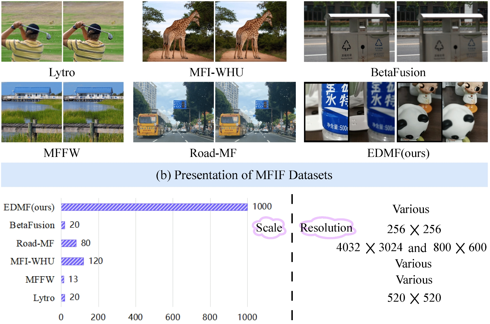
   

      <b>21. EDMF: A New Benchmark for Multi-Focus Images with the Challenge of Exposure Difference</b> 
      <strong><b>Hui Li*</b></strong>, Tianyu Shen, Zeyang Zhang, Xuefeng Zhu, Xiaoning Song 
      <b>Sensors</b> (IF: 3.4), 2024, 24(22), 7287.  
      [<a href="https://doi.org/10.3390/s24227287">paper</a>][arxiv][<a href="https://github.com/stywmy/EDMF">code</a>]
   

 

   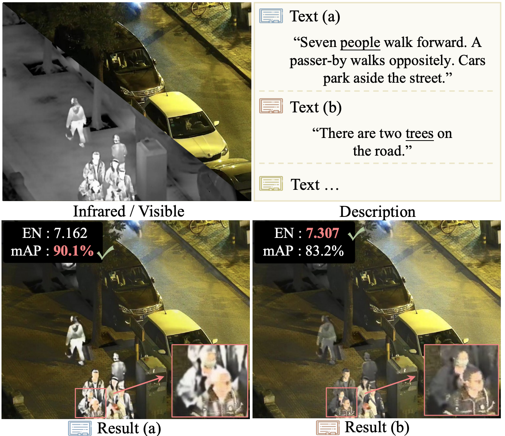
   

      <b>20. TextFusion: Unveiling the Power of Textual Semantics for Controllable Image Fusion</b> 
      Chunyang Cheng, Tianyang Xu, Xiao-Jun Wu*, <strong><b>Hui Li</b></strong>, Xi Li, Zhangyong Tang, Josef Kittler 
      Information Fusion (<b>InfFus</b>, IF: 14.7007), Volume 117, May 2025, 102790.  
      [<a href="">paper</a>][<a href="https://arxiv.org/abs/2312.14209">arxiv</a>][<a href="https://github.com/AWCXV/TextFusion">code</a>]
   

 

   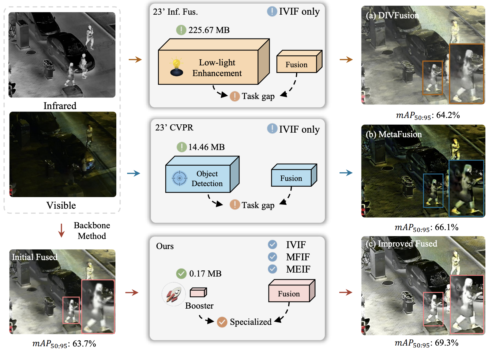
   

      <b>19. FusionBooster: A Unified Image Fusion Boosting Paradigm</b> 
      Chunyang Cheng, Tianyang Xu, Xiao-Jun Wu*, <strong><b>Hui Li</b></strong>, Xi Li, Josef Kittler  
      International Journal of Computer Vision (<b>IJCV</b>, IF: 11.6), 2024, Accepted.  
      [paper][<a href="https://arxiv.org/abs/2305.05970">arxiv</a>][<a href="https://github.com/AWCXV/FusionBooster">code</a>]
   

   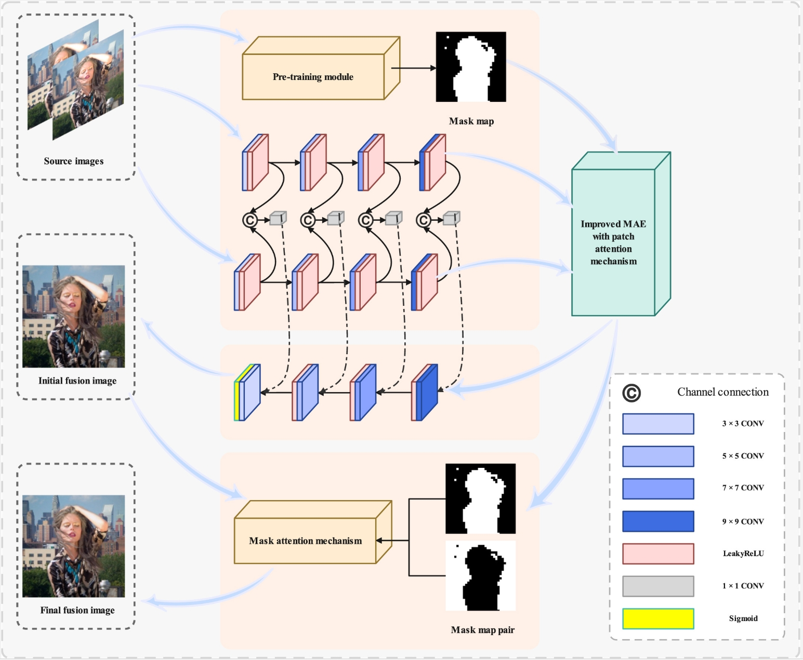
   

      <b>18. MMAE: A universal image fusion method via mask attention mechanism</b> 
      Xiangxiang Wang, Lixing Fang, Junli Zhao, Zhenkuan Pan, <strong><b>Hui Li</b></strong>, Yi Li*  
      Pattern Recognition (<b>PR</b>, IF: 7.4996), available online 26 September 2024, 111041.  
      [<a href="https://doi.org/10.1016/j.patcog.2024.111041">paper</a>][arxiv][<a href="https://github.com/xiangxiang-wang/MMAE">code</a>]
   

   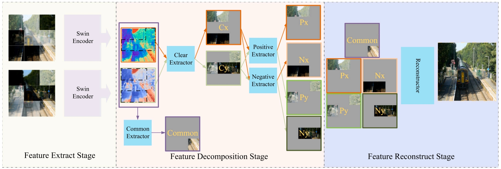
   

      <b>17. DDBFusion: An unified image decomposition and fusion framework based on dual decomposition and Bézier curves</b> 
      Zeyang Zhang, <strong><b>Hui Li</b></strong>, Tianyang Xu, Xiao-Jun Wu*, Josef Kittler 
      Information Fusion (<b>InfFus</b>, IF: 14.7007), Volume 114, February 2025, 102655.  
      [<a href="https://doi.org/10.1016/j.inffus.2024.102655">paper</a>][arxiv][<a href="https://github.com/Yukarizz/DDBFusion">code</a>]
   

  

   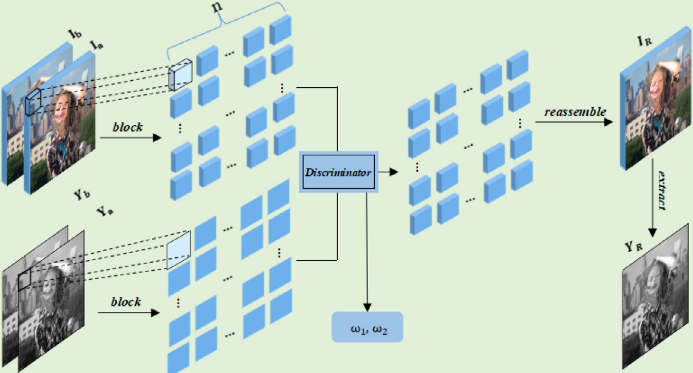
   

      <b>16. An unsupervised multi-focus image fusion method via dual-channel convolutional network and discriminator</b> 
      Lixing Fang, Xiangxiang Wang, Junli Zhao, Zhenkuan Pan, <strong><b>Hui Li*</b></strong>, Yi Li*  
      Computer Vision and Image Understanding (<b>CVIU</b>, IF: 4.2997), Volume: 244, July 2024, 104029.  
      [<a href="https://doi.org/10.1016/j.cviu.2024.104029">paper</a>][arxiv][code]
   

  

   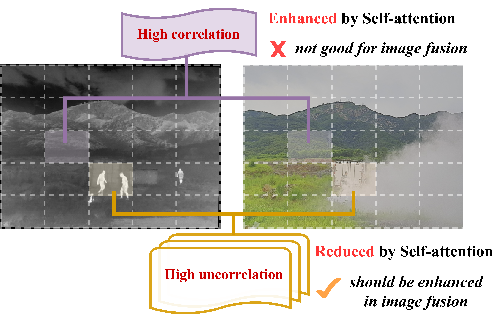
   

	   <b>15. CrossFuse: A Novel Cross Attention Mechanism based Infrared and Visible Image Fusion Approach</b> 
   	<strong><b>Hui Li*</b></strong>, Xiao-Jun Wu  
	   Information Fusion (<b>InfFus</b>, IF: 14.7007), Volume: 103, March 2024, 102147.  
   	[<a href="https://doi.org/10.1016/j.inffus.2023.102147">paper</a>][<a href="https://arxiv.org/abs/2406.10581">arxiv</a>][<a href="https://github.com/hli1221/CrossFuse">code</a>]
   

  

   
   

      <b>14. GuideFuse: A novel guided auto-encoder fusion network for infrared and visible images</b> 
      Zeyang Zhang, <strong><b>Hui Li</b></strong>, Tianyang Xu, Xiao-Jun Wu*, Yu Fu  
      IEEE Transactions on Instrumentation and Measurement (<b>TIM</b>, IF: 5.5999), 2023, Volume: 73, 5011211.  
      [<a href="https://doi.org/10.1109/TIM.2023.3306537">paper</a>][arxiv][<a href="https://github.com/Yukarizz/GuideFuse">code</a>]
   

  

   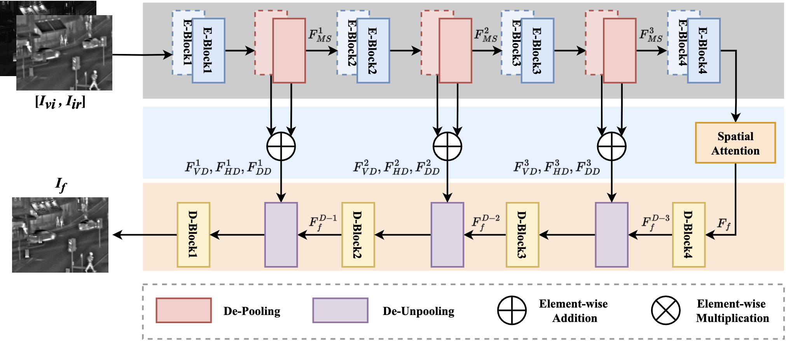
   

	   <b>13. DePF: A Novel Fusion Approach based on Decomposition Pooling for Infrared and Visible Images</b> 
   	<strong><b>Hui Li*</b></strong>, Yongbiao Xiao, Chunyang Cheng, Zhongwei Shen, Xiaoning Song  
	   IEEE Transactions on Instrumentation and Measurement (<b>TIM</b>, IF: 5.5999), 2023, Volume: 72, 5031014.  
   	[<a href="https://doi.org/10.1109/TIM.2023.3326252">paper</a>][<a href="https://arxiv.org/abs/2305.17376">arxiv</a>][<a href="https://github.com/draymondbiao/DePF">code</a>]
   

  

   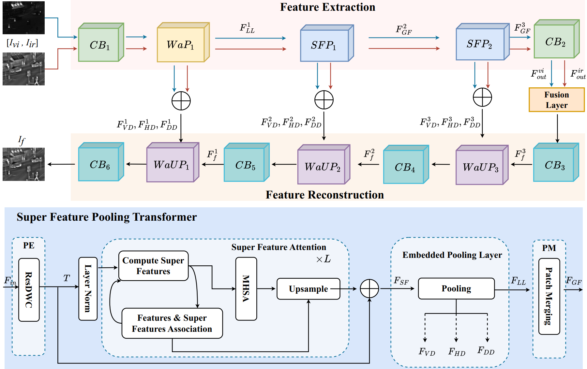
   

	   <b>12. SFPFusion: An Improved Vision Transformer Combining Super Feature Attention and Wavelet-Guided Pooling for Infrared and Visible Images Fusion</b> 
   	<strong><b>Hui Li*</b></strong>, Yongbiao Xiao, Chunyang Cheng, Xiaoning Song  
	   <b>Sensors</b> (IF: 3.4), 2023, volume: 23, number: 18, 2023: 7870  
   	[<a href="https://doi.org/10.3390/s23187870">paper</a>][arxiv][<a href="https://github.com/hli1221/SFPFusion">code</a>]
   

  

   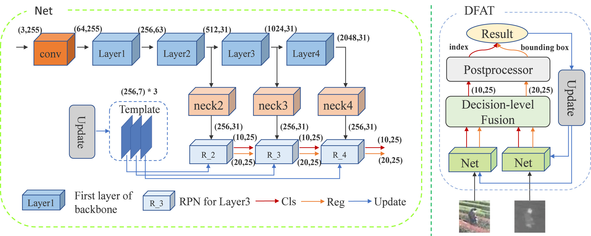
   

	   <b>11. Exploring fusion strategies for accurate RGBT visual object tracking</b> 
   	Zhangyong Tang, Tianyang Xu, <strong><b>Hui Li</b></strong>, Xiao-Jun Wu*, Xue-Feng Zhu, Josef Kittler  
	   Information Fusion (<b>InfFus</b>, IF: 14.7007), Volume: 99, November 2023, 101881.  
   	[<a href="https://doi.org/10.1016/j.inffus.2023.101881">paper</a>][<a href="https://arxiv.org/abs/2201.08673">arxiv</a>][<a href="https://github.com/Zhangyong-Tang/DFAT">code</a>]
   

  

   
   

	   <b>10. LRRNet: A novel representation learning guided fusion framework for infrared and visible images</b> 
   	<strong><b>Hui Li</b></strong>, Tianyang Xu, Xiao-Jun Wu*, Jiwen Lu, Josef Kittler  
	   IEEE Transactions on Pattern Analysis and Machine Intelligence (<b>TPAMI</b>, IF: 20.7991), Volume: 45, Issue: 9, pp. 11040-11052, April 2023  
      (Highly Cited Paper, *Hot Paper*)  
   	[<a href="https://doi.org/10.1109/TPAMI.2023.3268209">paper</a>][<a href="https://arxiv.org/abs/2304.05172">arxiv</a>][<a href="https://github.com/hli1221/imagefusion-LRRNet">code</a>]
   

  

   
   

	   <b>9. I Know How You Move: Explicit Motion Estimation for Human Action Recognition</b> 
   	Zhongwei Shen, Xiao-Jun Wu*, <strong><b>Hui Li</b></strong>, Tianyang Xu, Cong Wu  
	   IEEE Transactions on Multimedia (<b>TMM</b>, IF: 8.4001), 2022, Early Access.   
   	[<a href="https://doi.org/10.1109/TMM.2022.3211423">paper</a>][<a href="https://github.com/hli1221/MOTion-Estimator-MOTE-">code</a>]
   

  

   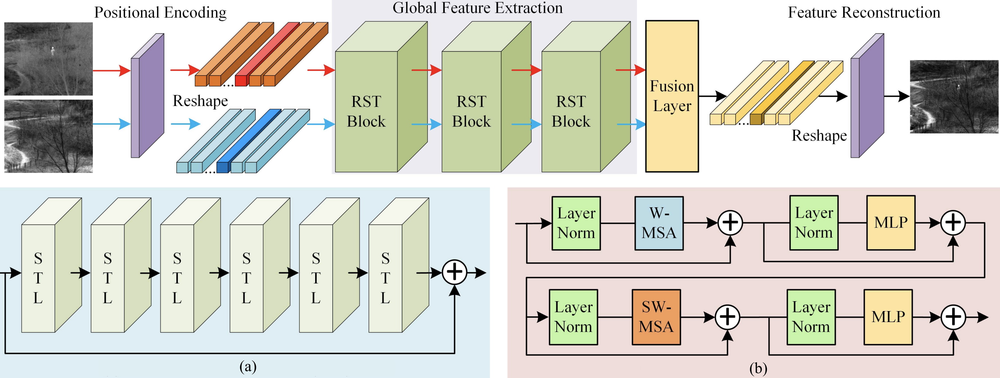
   

	   <b>8. SwinFuse: A Residual Swin Transformer Fusion Network for Infrared and Visible Images</b> 
   	Zhishe Wang*, Yanlin Chen, Wenyu Shao, <strong><b>Hui Li</b></strong>, Lei Zhang  
	   IEEE Transactions on Instrumentation and Measurement (<b>TIM</b>, IF: 5.5999), 2022, vol: 71.   
      (Highly Cited Paper)  
   	[<a href="https://doi.org/10.1109/TIM.2022.3191664">paper</a>][<a href="https://github.com/Zhishe-Wang/SwinFuse">code</a>]
   

 

   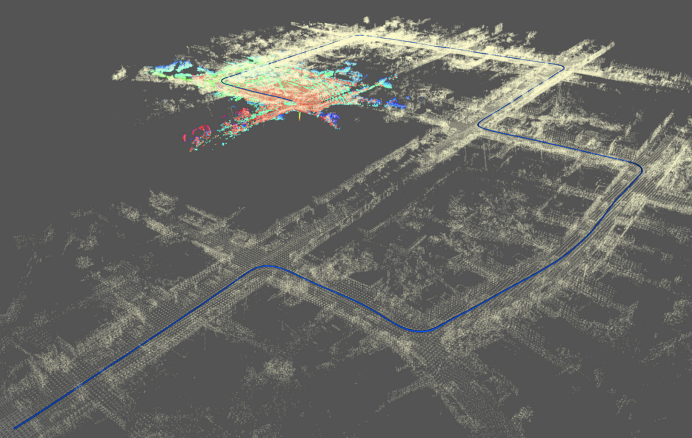
   

	   <b>7. Generalized n-Dimensional Rigid Registration: Theory and Applications</b> 
   	Jin Wu, Miaomiao Wang, Hassen Fourati, <strong><b>Hui Li</b></strong>, Yilong Zhu, Chengxi Zhang, Yi Jiang, Xiangcheng Hu, Ming Liu*  
	   IEEE Transactions on Cybernetics (<b>TCYB</b>, IF: 9.4006), Volume: 53, Issue: 2, February 2023.   
   	[<a href="https://doi.org/10.1109/TCYB.2022.3168938">paper</a>][<a href="https://github.com/zarathustr/GLnR">code</a>][<a href="https://youtu.be/BwfjQ9ZAyl4">video</a>]
   

 

   
   

	   <b>6. RFN-Nest: An end-to-end residual fusion network for infrared and visible images</b> 
   	<strong><b>Hui Li</b></strong>, Xiao-Jun Wu* , Josef Kittler  
	   Information Fusion (<b>InfFus</b>, IF: 14.7007), Volume: 73, Pages: 72-86, September 2021.  
	   (Highly Cited Paper)  
   	[<a href="https://doi.org/10.1016/j.inffus.2021.02.023">paper</a>][<a href="https://arxiv.org/abs/2103.04286">arxiv</a>][<a href="https://github.com/hli1221/imagefusion-rfn-nest">code</a>][<a href="https://www.researchgate.net/publication/350485612_sup-rfn-v2pdf">Supplementary Material</a>]
   

 

   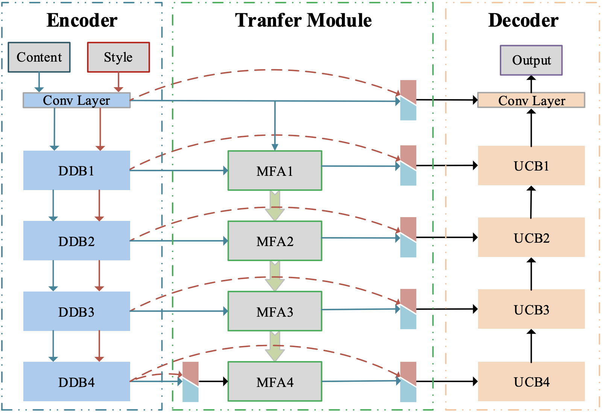
   

	   <b>5. UMFA: a photorealistic style transfer method based on U-Net and multi-layer feature aggregation</b> 
   	Dongyu Rao, Xiao-Jun Wu*, <strong><b>Hui Li</b></strong>, Josef Kittler, Tianyang Xu  
	   Journal of Electronic Imaging (<b>JEI</b>, IF: 1.0), Volume: 30, Issue: 5, pp. 053013, September 2021.  
   	[<a href="https://doi.org/10.1117/1.JEI.30.5.053013">paper</a>][<a href="https://arxiv.org/abs/2108.06113">arxiv</a>][<a href="https://github.com/dongyuya/UMFA">code</a>]
   

 

   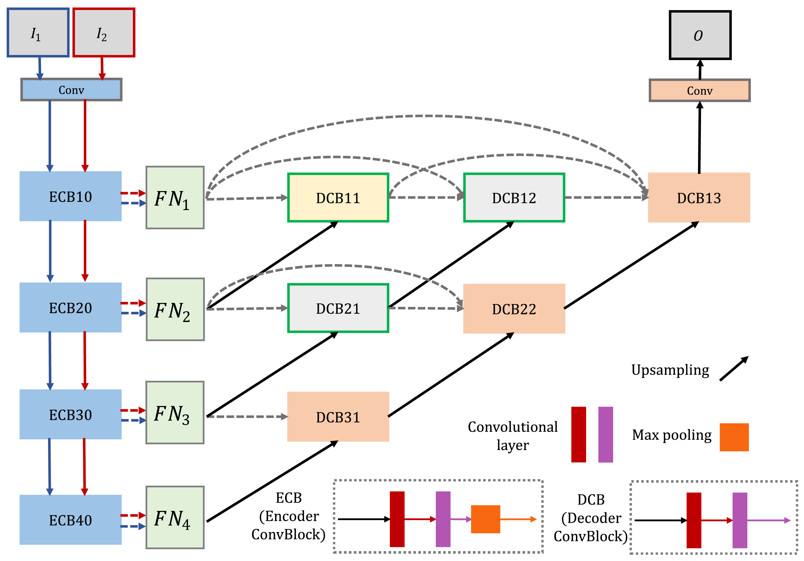
   

	   <b>4. NestFuse: An Infrared and Visible Image Fusion Architecture based on Nest Connection and Spatial/Channel Attention Models</b> 
   	<strong><b>Hui Li</b></strong>, Xiao-Jun Wu* , Tariq S. Durrani  
	   IEEE Transactions on Instrumentation and Measurement (<b>TIM</b>, IF: 5.5999), Volume: 69, Issue: 12, pp. 9645–9656, Dec. 2020.  
	   (Highly Cited Paper)  
   	[<a href="https://doi.org/10.1109/TIM.2020.3005230">paper</a>][<a href="https://arxiv.org/abs/2007.00328">arxiv</a>][<a href="https://github.com/hli1221/imagefusion-nestfuse">code</a>]
   

 

   
   

	   <b>3. MDLatLRR: A novel decomposition method for infrared and visible image fusion</b> 
   	<strong><b>Hui Li</b></strong>, Xiao-Jun Wu* , Josef Kittler  
	   IEEE Transactions on Image Processing (<b>TIP</b>, IF: 10.7997), Volume: 29, pp. 4733-4746, February, 2020.  
	   (Highly Cited Paper)  
   	[<a href="https://doi.org/10.1109/TIP.2020.2975984">paper</a>][<a href="https://arxiv.org/abs/1811.02291">arxiv</a>][<a href="https://github.com/hli1221/imagefusion_mdlatlrr">code</a>]
   

 

   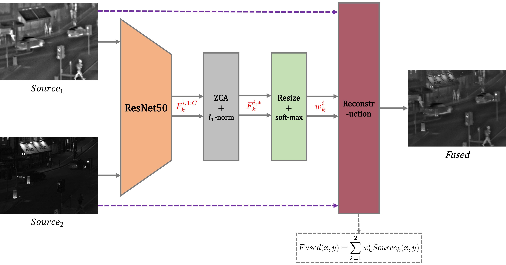
   

	   <b>2. Infrared and Visible Image Fusion with ResNet and zero-phase component analysis</b> 
   	<strong><b>Hui Li</b></strong>, Xiao-Jun Wu* , Tariq S. Durrani  
	   Infrared Physics & Technology (<b>JIPT</b>, IF: 3.1), Volume 102, November 2019, 103039.  
	   (Highly Cited Paper)  
   	[<a href="https://doi.org/10.1016/j.infrared.2019.103039">paper</a>][<a href="https://arxiv.org/abs/1806.07119">arxiv</a>][<a href="https://github.com/hli1221/imagefusion_resnet50">code</a>]
   

 

   
   

	   <b>1. DenseFuse: A Fusion Approach to Infrared and Visible Images</b> 
   	<strong><b>Hui Li</b></strong>, Xiao-Jun Wu*  
	   IEEE Transactions on Image Processing (<b>TIP</b>, IF: 10.7997), Volume: 28, Issue: 5, pp. 2614–2623, May. 2019.  
	   (Highly Cited Paper)  
   	[<a href="https://doi.org/10.1109/TIP.2018.2887342">paper</a>][<a href="https://arxiv.org/abs/1804.08361">arxiv</a>][<a href="https://github.com/hli1221/imagefusion_densefuse">code</a>]
   

 

## Conference papers

   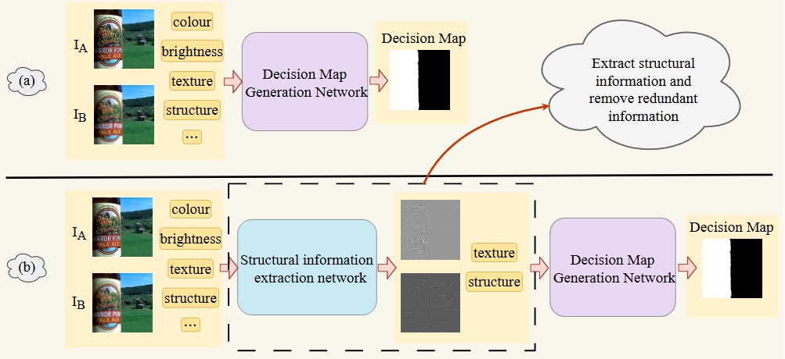
   

      <b>12. SMFuse: Two-Stage Structural Map Aware Network for Multi-focus Image Fusion</b> 
      Tianyu Shen, <strong><b>Hui Li*</b></strong>, Chunyang Cheng, Zhongwei Shen, and Xiaoning Song  
      The 27th International Conference on Pattern Recognition (<b>ICPR 2024</b>), December 01-05, 2024, Kolkata, India.  
      [<a href="https://doi.org/10.1007/978-3-031-78312-8_1">paper</a>][arxiv][<a href="https://github.com/stywmy/SMFuse">code</a>]
   

  

   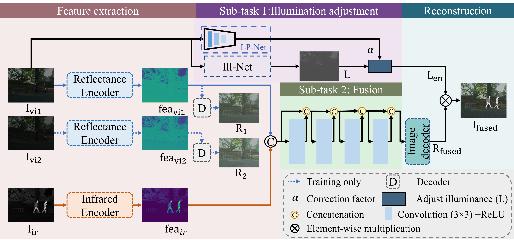
   

      <b>11. IFFusion: Illumination-free Fusion Network for Infrared and Visible Images</b> 
      Chengcheng Song, <strong><b>Hui Li</b></strong>, Tianyang Xu, Zeyang Zhang, and Xiao-Jun Wu*  
      The 27th International Conference on Pattern Recognition (<b>ICPR 2024</b>), December 01-05, 2024, Kolkata, India.  
      [<a href="https://doi.org/10.1007/978-3-031-78169-8_4">paper</a>][arxiv][<a href="https://github.com/song-chengcheng/IFFusion">code</a>]
   

  

   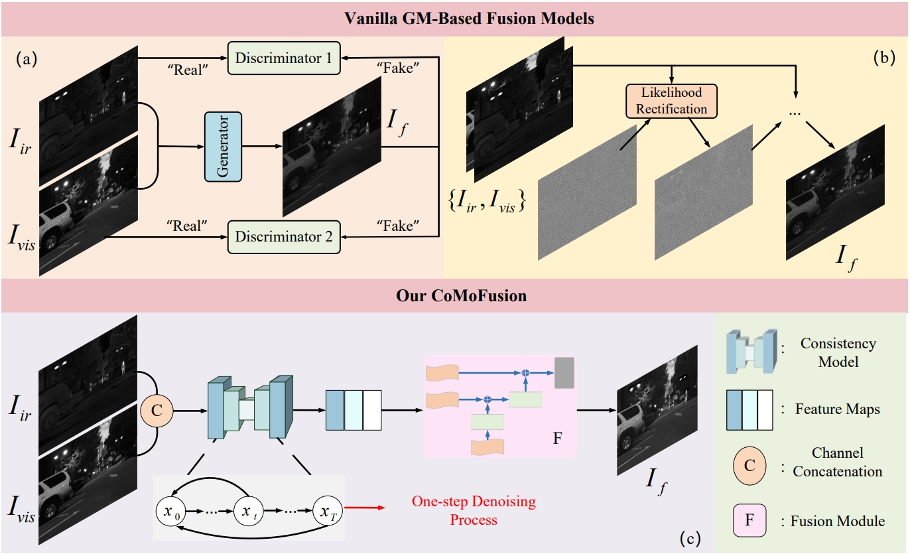
   

      <b>10. CoMoFusion: Fast and High-quality Fusion of Infrared and Visible Image with Consistency Model</b> 
      Zhiming Meng, <strong><b>Hui Li*</b></strong>, Zeyang Zhang, Zhongwei Shen, Yunlong Yu, Xiaoning Song, Xiaojun Wu  
      The 7th Chinese Conference on Pattern Recognition and Computer Vision (<b>PRCV 2024</b>), October 18-20, 2024, Urumqi, China.  
      [<a herf="https://doi.org/10.1007/978-981-97-8685-5_38">paper</a>][<a href="https://arxiv.org/abs/2405.20764">arxiv</a>][<a href="https://github.com/ZhimingMeng/CoMoFusion">code</a>]
   

  

   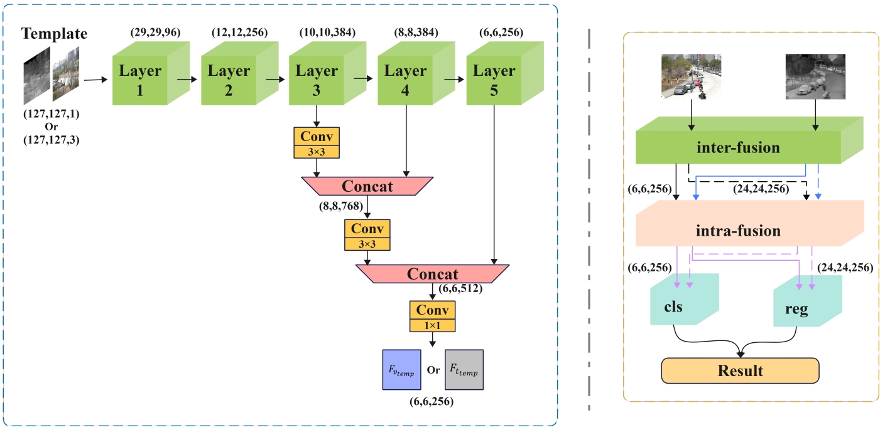
   

      <b>9. TandemFuse: An Intra-and Inter-Modal Fusion Strategy for RGB-T Tracking</b> 
      Xinyang Zhou, <strong><b>Hui Li*</b></strong>  
      The 2024 2nd Asia Conference on Computer Vision, Image Processing and Pattern Recognition (<b>CVIPPR 2024</b>), Apirl 26-28, 2024, Xiamen, China.  
      [<a href="https://doi.org/10.1145/3663976.3663996">paper</a>][arxiv][code]
   

 

   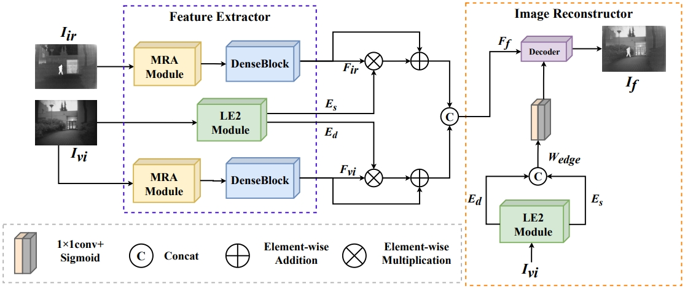
   

	   <b>8. LE2Fusion: A novel local edge enhancement module for infrared and visible image fusion</b> 
   	Yongbiao Xiao, <strong><b>Hui Li*</b></strong>, Chunyang Cheng, Xiaoning Song  
	   International Conference on Image and Graphics (<b>ICIG 2023</b>), 29 October 2023, Nanjing, China.  
   	[<a href="https://doi.org/10.1007/978-3-031-46305-1_24">paper</a>][<a href="https://arxiv.org/abs/2305.17374">arxiv</a>][<a href="https://github.com/hli1221/LE2Fusion">code</a>]
   

  

   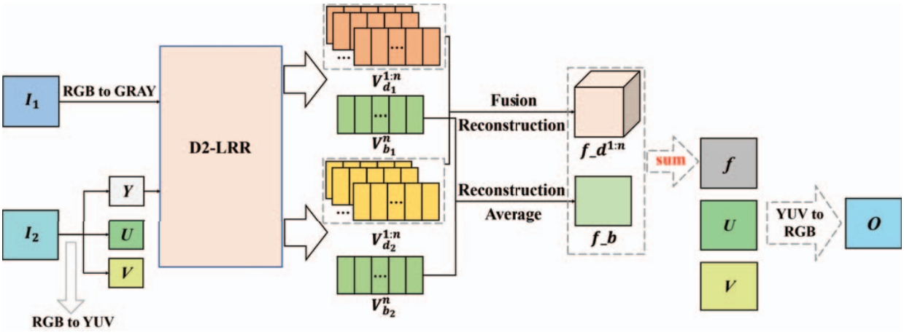
   

	   <b>7. D2-LRR: A Medical Image Fusion Method based on Dual-decomposed MDLatLRR</b> 
   	Xu Song, Tianyu Shen, <strong><b>Hui Li*</b></strong>, Xiao-Jun Wu  
	   International Conference on Machine Vision, Image Processing & Imaging Technology (<b>MVIPIT 2023</b>), 24 September 2023, Hangzhou, Zhejiang, China.  
   	[<a href="https://doi.org/10.1109/MVIPIT60427.2023.00010">paper</a>][<a href="https://arxiv.org/abs/2206.15179">arxiv</a>][<a href="https://github.com/songxujay/MDLatLRRv2">code</a>]
   

  

   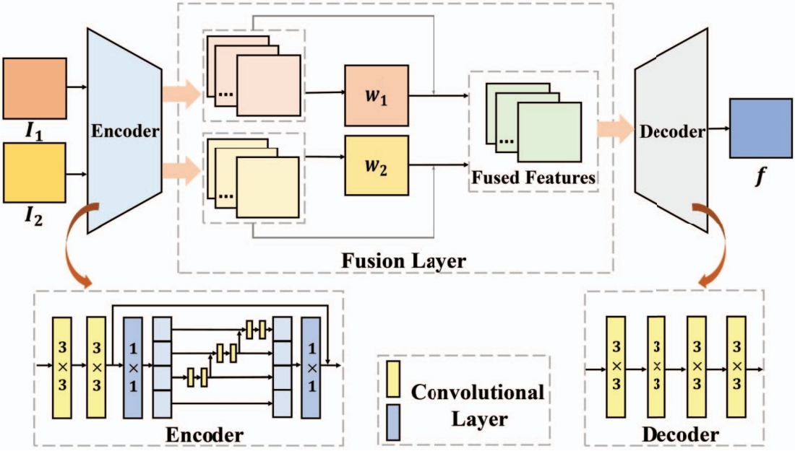
   

	   <b>6. Res2NetFuse: A Fusion Method for Infrared and Visible Images</b> 
   	Xu Song, Yongbiao Xiao, <strong><b>Hui Li*</b></strong>, Xiao-Jun Wu, Jun Sun, Valsile Palade  
	   International Conference on Machine Vision, Image Processing & Imaging Technology (<b>MVIPIT 2023</b>), 24 September 2023, Hangzhou, Zhejiang, China.  
   	[<a href="https://doi.org/10.1109/MVIPIT60427.2023.00009">paper</a>][<a href="">arxiv</a>][<a href="https://github.com/songxujay/Res2NetFuse">code</a>]
   

   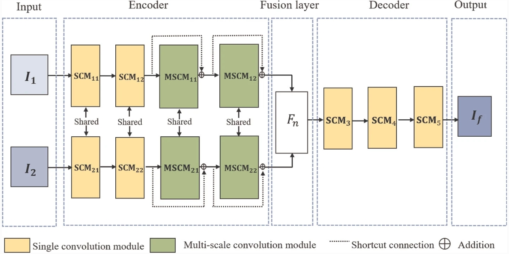
   

	   <b>5. MSC-Fuse: An Unsupervised Multi-scale Convolutional Fusion Framework for Infrared and Visible Image</b> 
   	Guo-Yang Chen, Xiao-Jun Wu* , <strong><b>Hui Li</b></strong>, Tian-Yang Xu  
	   International Conference on Image and Graphics (<b>ICIG 2021</b>), 30 September 2021, Haikou, China. Lecture Notes in Computer Science, vol 12888. Springer, Cham.  
   	[<a href="https://doi.org/10.1007/978-3-030-87355-4_4">paper</a>][<a href="https://github.com/cgyfocus/icig_mscfuse">code</a>]
   

   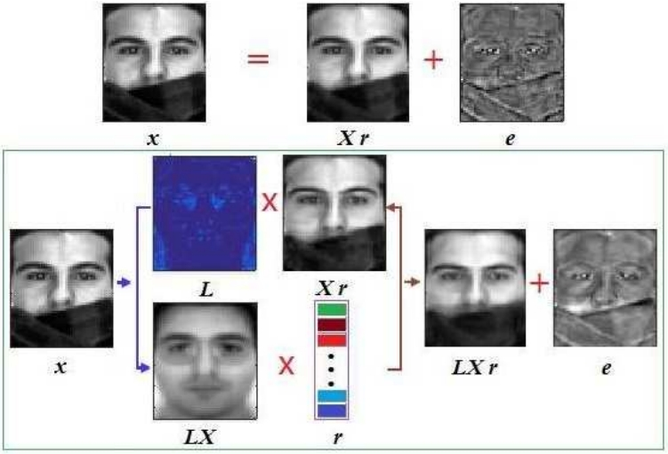
   

	   <b>4. Subspace Clustering via Joint Unsupervised Feature Selection</b> 
   	Wenhua Dong, Xiao-Jun Wu* , <strong><b>Hui Li</b></strong>, Zhen-Hua Feng, Josef Kittler  
	  	IEEE International Conference on Pattern Recognition (<b>ICPR 2020</b>), 2021, Page(s): 3892 - 3898. Beijing, China. 
   	[<a href="https://doi.org/10.1109/ICPR48806.2021.9413101">paper</a>][code]
   

   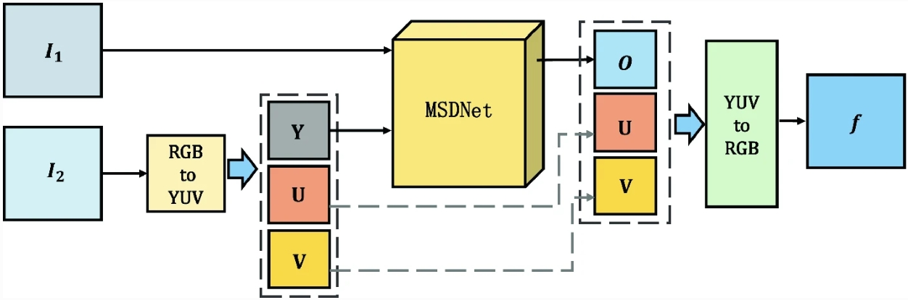
   

	   <b>3. MSDNet for Medical Image Fusion</b> 
   	Xu Song, Xiao-Jun Wu* , <strong><b>Hui Li</b></strong>  
	 	International Conference on Image and Graphics (<b>ICIG 2019</b>), 28 November 2019, Beijing, China. Lecture Notes in Computer Science, vol 11902. Springer, Cham.   
   	[<a href="https://doi.org/10.1007/978-3-030-34110-7_24">paper</a>][<a href="https://github.com/songxujay/MSDNet-for-Medical-Image-Fusion">code</a>]
   

   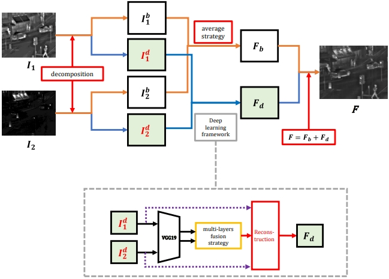
   

	   <b>2. Infrared and Visible Image Fusion using a Deep Learning Framework</b> 
   	<strong><b>Hui Li</b></strong>, Xiao-Jun Wu* , Josef Kittler  
	   IEEE International Conference on Pattern Recognition (<b>ICPR 2018</b>), 2018, Page(s):2705 - 2710. Beijing, China.  
      (Google citation: 556)  
   	[<a href="https://doi.org/10.1109/ICPR.2018.8546006">paper</a>][<a href="https://arxiv.org/abs/1804.06992">arxiv</a>][<a href="https://github.com/hli1221/imagefusion_deeplearning">code</a>]
   

 

   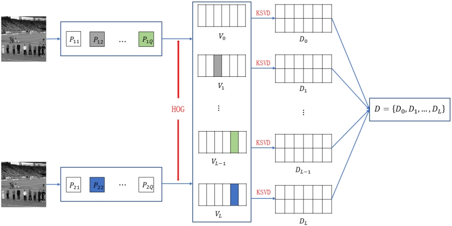
   

	   <b>1. Multi-focus Image Fusion Using Dictionary Learning and Low-Rank Representation</b> 
   	<strong><b>Hui Li</b></strong>, Xiao-Jun Wu*  
	   International Conference on Image and Graphics (<b>ICIG 2017</b>), Shanghai, China. Springer, Cham, 2017: 675 - 686.  
      (Google citation: 116)  
   	[<a href="https://doi.org/10.1007/978-3-319-71607-7_59">paper</a>][<a href="https://arxiv.org/abs/1804.08355">arxiv</a>][<a href="https://github.com/hli1221/imagefusion_dllrr">code</a>]
   

 

---
# Preprint

   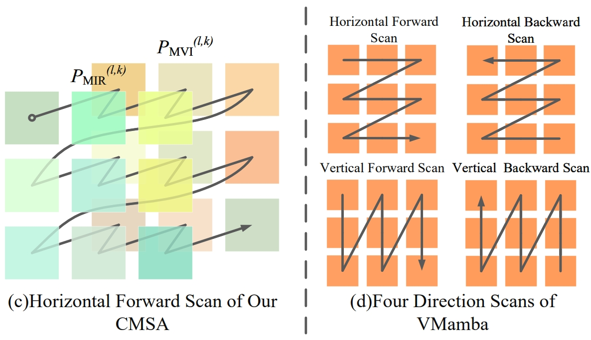
   

      <b>3. S4Fusion: Saliency-aware Selective State Space Model for Infrared Visible Image Fusion</b> 
      Haolong Ma, <strong><b>Hui Li*</b></strong>, Chunyang Cheng, Gaoang Wang, Xiaoning Song, Xiaojun Wu  
      arXiv 2024  
      [<a href="https://arxiv.org/abs/2405.20881">arxiv</a>][<a href="https://github.com/zipper112/S4Fusion">code</a>]
   

  

   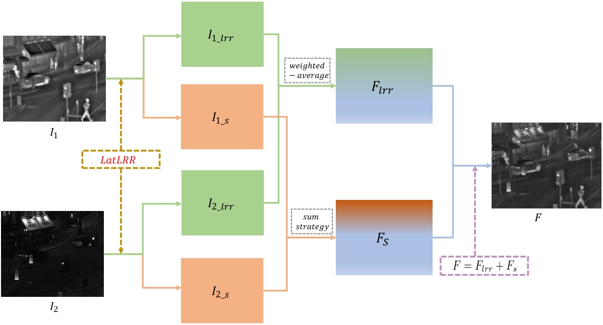
   

	   <b>2. Infrared and visible image fusion using Latent Low-Rank Representation</b> 
   	<strong><b>Hui Li</b></strong>, Xiao-Jun Wu*  
	   arXiv 2017  
      (Google citation: 208)  
   	[<a href="https://arxiv.org/abs/1804.08992">arxiv</a>][<a href="https://github.com/hli1221/imagefusion_Infrared_visible_latlrr">code</a>]
   

  

   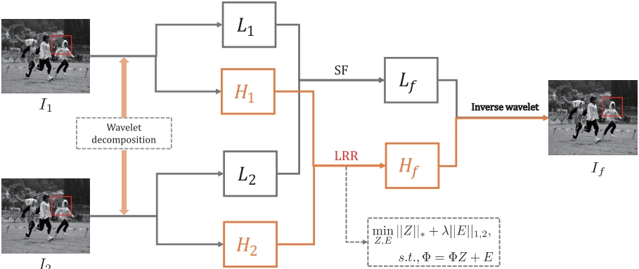
   

	   <b>1. Multi-focus Noisy Image Fusion using Low-Rank Representation</b> 
   	<strong><b>Hui Li</b></strong>, Xiao-Jun Wu*, Tariq Durrani  
	   arXiv 2017  
   	[<a href="https://arxiv.org/abs/1804.09325">arxiv</a>][<a href="https://github.com/hli1221/imagefusion_noisy_lrr">code</a>]
   

---
# Contest

   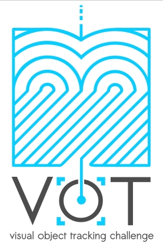
   

	   <b>The Tenth Visual Object Tracking VOT2022 Challenge Results</b> 
   	Zhangyong Tang, Xuefeng Zhu, Tianyang Xu, Jiaye Chen, Ze Kang, <strong><b>Hui Li</b></strong>, Shaochuan Zhao, Xiao-Jun Wu, Josef Kittler, Xi Li  
	   VOT-D 2022 subchallenge (<b>RSDiMP, 2nd place</b>)   
   	[<a href="https://www.votchallenge.net/vot2022/">home page</a>][<a href="https://prints.vicos.si/publications/416">VOT report</a>]
   

  

   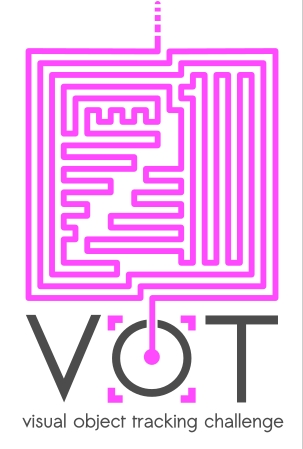
   

	   <b>The Ninth Visual Object Tracking VOT2021 Challenge Results</b> 
   	Xuefeng Zhu, Zhangyong Tang, Tianyang Xu, <strong><b>Hui Li</b></strong>, Shaochuan Zhao, Xiao-Jun Wu, Josef Kittler  
	   VOT2021 RGBD subchallenge (<b>TALGD, 2nd place</b>)  
   	[<a href="https://www.votchallenge.net/vot2021/">home page</a>][<a href="https://prints.vicos.si/publications/400">VOT report</a>]
   

   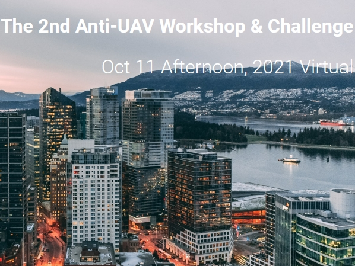
   

	   <b>Detection and tracking of UAV in the wild ICCV Workshop 2021</b> 
   	Xuefeng Zhu, Zhangyong Tang, <strong><b>Hui Li</b></strong>, Tianyang Xu, Xiao-Jun Wu, Josef Kittler  
	  	The Second Anti-UAV Workshop & Challenge 2021 (3rd place award)   
   	[<a href="https://anti-uav.github.io/leaderboard2/">home page</a>]
   

   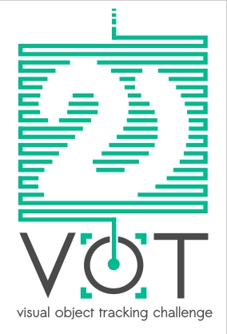
   

	   <b>The Eighth Visual Object Tracking VOT2020 Challenge Results</b> 
   	<strong><b>Hui Li</b></strong>, Wu Xiao-Jun, Josef Kittler, Tianyang Xu, Xuefeng Zhu, Yunkun Li  
	  	VOT2020 RGB thermal and infrared subchallenge (<b>DFAT</b>, The winning tracker award)  
   	[<a href="https://www.votchallenge.net/vot2020/">home page</a>][<a href="http://prints.vicos.si/publications/384">VOT report</a>][<a href="https://github.com/Zhangyong-Tang/DFAT">code</a>]
   

   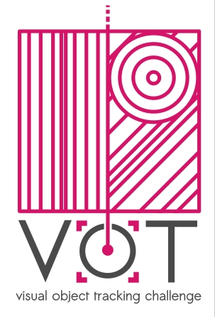
   

	   <b>The Seventh Visual Object Tracking VOT2019 Challenge Results</b> 
   	<strong><b>Hui Li</b></strong>, Zhangyong Tang, Tianyang Xu, Xuefeng Zhu, Xiao-Jun Wu, Josef Kittler  
	  	VOT2019 RGB thermal and infrared subchallenge (<b>FSRPN, 4th in public dataset</b>)   
   	[<a href="http://www.votchallenge.net/vot2019/index.html">home page</a>][<a href="http://prints.vicos.si/publications/375">VOT report</a>][<a href="https://github.com/hli1221/rgbt-tracking-fsrpn">code</a>]
   

	
---
# Experience

**2022.01 ~ now:** Lecturer, School of Artificial Intelligence and Computer Science, Jiangnan University, China.  
**2018.09 ~ 2021.12:** Ph.D candidate in Control Science and Engineering in school of IoT, Jiangnan University, China.  
**2016.09 ~ 2018.06:** Master in Computer science and technology in Jiangnan University, China.  
**2015.06 ~ 2016.08:** Software engineer in Nanjing, China.  
**2011.09 ~ 2015.06:** Bachelor in Computer science and technology in school of IoT, Jiangnan University, China.  

---
# Activities

Associate Editor: Springer Nature (SN) Computer Science  
Reviewer: CVPR, ICCV, NeurIPS, ECCV, AAAI, IEEE TPAMI, IJCV, IEEE TIP, Information Fusion, IEEE TMM, IEEE TCSVT, ...  

