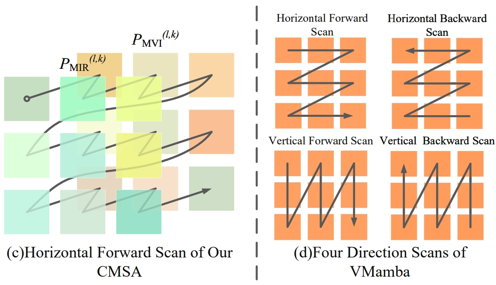
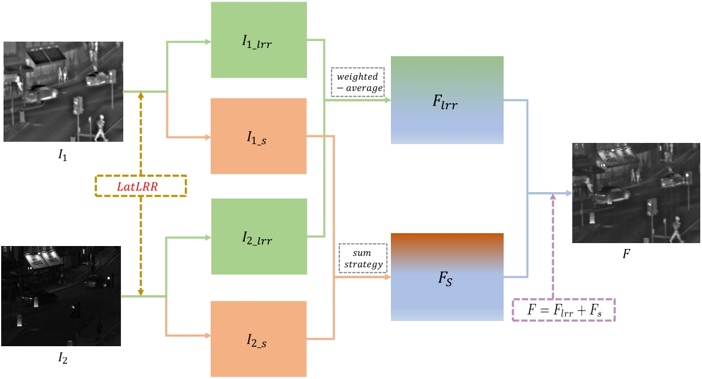
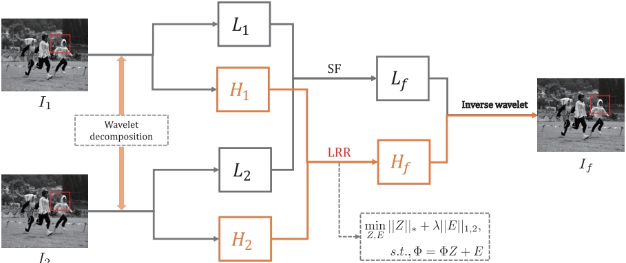
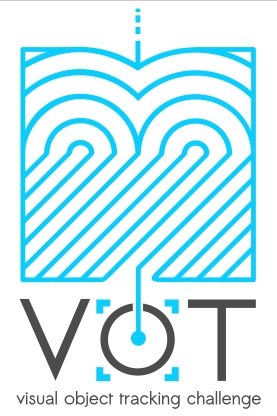
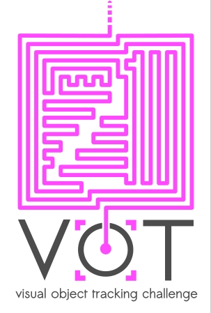
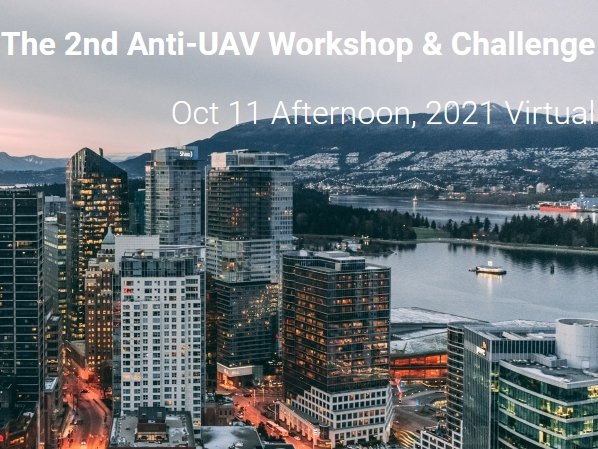
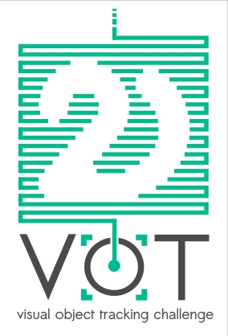
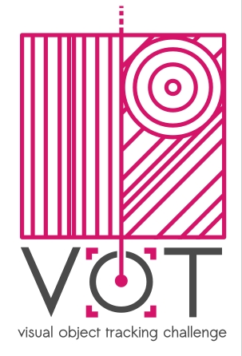

I received B.A. degree from School of Internet of Things Engineering at Jiangnan University, in 2015. For two years up to 2018, I studied as a Master student in Jiangsu Provincial Engineering Laboratory of Pattern Recognition and Computational Intelligence, Jiangnan University. I received my Ph.D. degree at Jiangsu Provincial Engineering Laboratory of Pattern Recognition and Computational Intelligence, [Jiangnan University](http://www.jiangnan.edu.cn/), in December of 2021, supervised by [Pro. Xiao-Jun Wu](http://ai.jiangnan.edu.cn/info/1013/1500.htm). 

I am currently an Associate Professor ([home page](https://ai.jiangnan.edu.cn/info/1014/4428.htm)) at the School of Artificial Intelligence and Computer Science and the International Joint Laboratory on Artificial Intelligence of Jiangsu Province, Jiangnan University, Wuxi, China. My research interests include computer vision, multi-modal image fusion, multi-modal super-resolution and multi-modal detection/tracking. 

I have published several scientific papers (8 highly cited papers, 2 hot paper), including IEEE TPAMI, IJCV, IEEE TIP, CVPR, NeurIPS, Information Fusion etc. I achieved top tracking performance in several competitions, including the VOT2020 RGBT challenge (ECCV20), VOT2021 RGBD challenge (ICCV21) and Anti-UAV challenge (ICCV21). I have been chosen among [the World's Top 2% Scientists ranking in the single recent year dataset published by Stanford University (2022, 2023, 2024, 2025)](https://elsevier.digitalcommonsdata.com/datasets/btchxktzyw/8).

**Current research:**
+ Computer vision  
+ Multi-modal fusion, super-resolution  
+ Multi-modal detection, tracking 

**Email:**  
+ lihui.cv@jiangnan.edu.cn  
+ hui_li_jnu@163.com  

<!-- ---
# Github Infor

 -->
 
<!-- height="165" -->
<!-- 

    
    
    

 -->

---
# Students

Mater students (Co-advised with [Prof. Xiaoning Song](https://ai.jiangnan.edu.cn/info/1013/1507.htm) and [Prof. Xiaoqing Luo](https://ai.jiangnan.edu.cn/info/1013/3246.htm))  
- [Yongbiao Xiao (Graduated)](https://github.com/draymondbiao)  
- [Tianyu Shen (Graduated)](https://github.com/stywmy)  
- [Haolong Ma](https://github.com/zipper112)  
- [Congcong Bian](https://github.com/bociic)  
- [Zhiming Meng](https://github.com/ZhimingMeng)  
- [Jiancong Xu](https://github.com/xjcong404)  
- Sheng Huang  
- [Ziyang Liu](https://github.com/Vegetvigbird)  
- Zhijia Din  
- Jingwen Tan  
- Zhenpeng Gao

---
# News

- **2026.05:** Two papers led by Huan Kang and Xinchang Wang were accepted by ICML 2026.
- **2026.04:** [EvaJudge](http://www.evanet.online:5001/), a converged online image fusion evaluation platform based on our TPAMI work (**EvaNet**), is now available. **It provides a unified evaluation environment and a public leaderboard mechanism, supporting efficient evaluation of image fusion methods**.
- **2026.02:** Two papers led by Congcong Bian and Yanglin Deng were accepted by CVPR 2026.

---
# Publications




   
      
   
   
      
   


   <a class="publication-navigation-item" href="{{ site.baseurl }}/journal-publication/">
      Journal list
      {{ journal_publication_count }} publications
   </a>
   <a class="publication-navigation-item" href="{{ site.baseurl }}/conference-publication/">
      Conference list
      {{ conference_publication_count }} publications
   </a>

# Preprint

<!-- 

   
   

      <b>3. S4Fusion: Saliency-aware Selective State Space Model for Infrared Visible Image Fusion</b> 
      Haolong Ma, <strong><b>Hui Li*</b></strong>, Chunyang Cheng, Gaoang Wang, Xiaoning Song, Xiaojun Wu  
      arXiv 2024  
      [<a href="https://arxiv.org/abs/2405.20881">arxiv</a>][<a href="https://github.com/zipper112/S4Fusion">code</a>]
   

   -->

   
   

	   <b>2. Infrared and visible image fusion using Latent Low-Rank Representation</b> 
   	<strong><b>Hui Li</b></strong>, Xiao-Jun Wu*  
	   arXiv 2017  
      (Google citation: 258)  
   	[<a href="https://arxiv.org/abs/1804.08992">arxiv</a>][<a href="https://github.com/hli1221/imagefusion_Infrared_visible_latlrr">code</a>]
   

  

   
   

	   <b>1. Multi-focus Noisy Image Fusion using Low-Rank Representation</b> 
   	<strong><b>Hui Li</b></strong>, Xiao-Jun Wu*, Tariq Durrani  
	   arXiv 2017  
   	[<a href="https://arxiv.org/abs/1804.09325">arxiv</a>][<a href="https://github.com/hli1221/imagefusion_noisy_lrr">code</a>]
   

---
# Contest

   
   

	   <b>The Tenth Visual Object Tracking VOT2022 Challenge Results</b> 
   	Zhangyong Tang, Xuefeng Zhu, Tianyang Xu, Jiaye Chen, Ze Kang, <strong><b>Hui Li</b></strong>, Shaochuan Zhao, Xiao-Jun Wu, Josef Kittler, Xi Li  
	   VOT-D 2022 subchallenge (<b>RSDiMP, 2nd place</b>)   
   	[<a href="https://www.votchallenge.net/vot2022/">home page</a>][<a href="https://prints.vicos.si/publications/416">VOT report</a>]
   

  

   
   

	   <b>The Ninth Visual Object Tracking VOT2021 Challenge Results</b> 
   	Xuefeng Zhu, Zhangyong Tang, Tianyang Xu, <strong><b>Hui Li</b></strong>, Shaochuan Zhao, Xiao-Jun Wu, Josef Kittler  
	   VOT2021 RGBD subchallenge (<b>TALGD, 2nd place</b>)  
   	[<a href="https://www.votchallenge.net/vot2021/">home page</a>][<a href="https://prints.vicos.si/publications/400">VOT report</a>]
   

   
   

	   <b>Detection and tracking of UAV in the wild ICCV Workshop 2021</b> 
   	Xuefeng Zhu, Zhangyong Tang, <strong><b>Hui Li</b></strong>, Tianyang Xu, Xiao-Jun Wu, Josef Kittler  
	  	The Second Anti-UAV Workshop & Challenge 2021 (3rd place award)   
   	[<a href="https://anti-uav.github.io/leaderboard2/">home page</a>]
   

   
   

	   <b>The Eighth Visual Object Tracking VOT2020 Challenge Results</b> 
   	<strong><b>Hui Li</b></strong>, Zhangyong Tang, Tianyang Xu, Xuefeng Zhu, Xiao-Jun Wu, Josef Kittler   
	  	VOT2020 RGB thermal and infrared subchallenge (<b>DFAT</b>, The winning tracker award)  
   	[<a href="https://www.votchallenge.net/vot2020/">home page</a>][<a href="http://prints.vicos.si/publications/384">VOT report</a>][<a href="https://github.com/Zhangyong-Tang/DFAT">code</a>]
   

   
   

	   <b>The Seventh Visual Object Tracking VOT2019 Challenge Results</b> 
      <strong><b>Hui Li</b></strong>, Wu Xiao-Jun, Josef Kittler, Tianyang Xu, Xuefeng Zhu, Yunkun Li  
	  	VOT2019 RGB thermal and infrared subchallenge (<b>FSRPN, 4th in public dataset</b>)   
   	[<a href="http://www.votchallenge.net/vot2019/index.html">home page</a>][<a href="http://prints.vicos.si/publications/375">VOT report</a>][<a href="https://github.com/hli1221/rgbt-tracking-fsrpn">code</a>]
   

	
---
# Experience

**2025.07 ~ now:** Associate Professor, School of Artificial Intelligence and Computer Science, Jiangnan University, China.  
**2022.01 ~ 2025.07:** Lecturer, School of Artificial Intelligence and Computer Science, Jiangnan University, China.  
**2018.09 ~ 2021.12:** Ph.D candidate in Control Science and Engineering in School of IoT, Jiangnan University, China.  
**2016.09 ~ 2018.06:** Master in Computer science and technology in School of IoT, Jiangnan University, China.  
**2015.06 ~ 2016.08:** Software engineer in Nanjing, China.  
**2011.09 ~ 2015.06:** Bachelor in Computer science and technology in school of IoT, Jiangnan University, China.  

---
# Activities

Associate Editor: Springer Nature (SN) Computer Science  
Reviewer: IEEE TPAMI, IJCV, IEEE TIP, CVPR, ICCV, ECCV, NeurIPS, ICML, ICLR, AAAI, IJCAI, Information Fusion ...  

