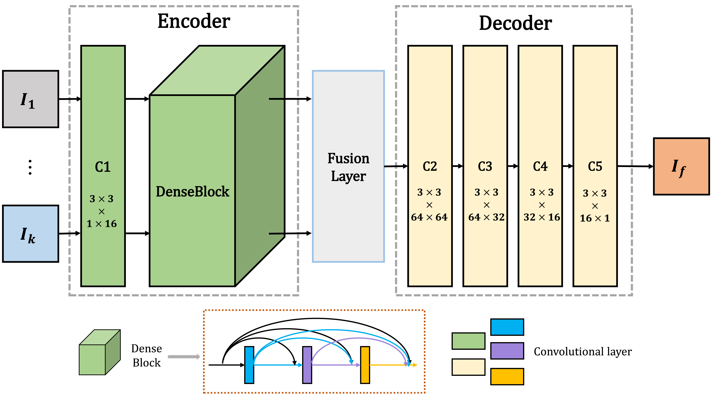

I received B.A. degree from School of Internet of Things Engineering at Jiangnan University, in 2015. For two years up to 2018, I studied as a Master student in Jiangsu Provincial Engineering Laboratory of Pattern Recognition and Computational Intelligence, Jiangnan University. I received my Ph.D. degree at Jiangsu Provincial Engineering Laboratory of Pattern Recognition and Computational Intelligence, [Jiangnan University](http://www.jiangnan.edu.cn/), in December of 2021, supervised by [Pro. Xiao-Jun Wu](http://ai.jiangnan.edu.cn/info/1013/1500.htm). 

I am currently a Lecturer ([home page](http://ai.jiangnan.edu.cn/info/1081/2936.htm)) at the School of Artificial Intelligence and Computer Science and the International Joint Laboratory on Artificial Intelligence of Jiangsu Province, Jiangnan University, Wuxi, China. My research interests include computer vision, image fusion and multi-modal visual information processing/Tracking. 

I have published several scientific papers (including five highly cited papers), including IEEE TPAMI, IEEE TIP, Information Fusion, IEEE TIM etc. I achieved top tracking performance in several competitions, including the VOT2020 RGBT challenge (ECCV20), VOT2021 RGBD challenge (ICCV21) and Anti-UAV challenge (ICCV21). I have been chosen among [the World's Top 2% Scientists ranking in the single recent year dataset published by Stanford University (2022, 2023)](https://elsevier.digitalcommonsdata.com/datasets/btchxktzyw/6).

**Email:**  
*lihui.cv@jiangnan.edu.cn*  
*hui_li_jnu@163.com*  
<!--*hui.li.cv@gmail.com*  -->

---
# Current research

+ Computer vision, deep learning
+ Multi-modal visual information FUSION, TRACKING  
+ Multi-modal information processing  

<!-- ---
# GitHub stats

 -->
---
# Publications

## Journal papers (15)

   
   

      <b>15. GuideFuse: A novel guided auto-encoder fusion network for infrared and visible images</b> 
      Zeyang Zhang, <strong><b>Hui Li</b></strong>, Tianyang Xu, Xiao-Jun Wu*, Yu Fu  
      IEEE Transactions on Instrumentation and Measurement (<b>TIM</b>), 2023, Early Access.  
      [<a href="https://doi.org/10.1109/TIM.2023.3306537">paper</a>][arxiv][<a href="https://github.com/Yukarizz/GuideFuse">code</a>]
   

  

   
   

	   <b>14. CrossFuse: A Novel Cross Attention Mechanism based Infrared and Visible Image Fusion Approach</b> 
   	<strong><b>Hui Li*</b></strong>, Xiao-Jun Wu  
	   Information Fusion (<b>InfFus</b>), Volume: 103, March 2024, 102147.  
   	[<a href="https://doi.org/10.1016/j.inffus.2023.102147">paper</a>][arxiv][code]
   

  

   
   

	   <b>13. DePF: A Novel Fusion Approach based on Decomposition Pooling for Infrared and Visible Images</b> 
   	<strong><b>Hui Li*</b></strong>, Yongbiao Xiao, Chunyang Cheng, Zhongwei Shen, Xiaoning Song  
	   IEEE Transactions on Instrumentation and Measurement (<b>TIM</b>), 2023, Volume: 72, pp. 1-14.  
   	[<a href="https://ieeexplore.ieee.org/document/10288477">paper</a>][<a href="https://arxiv.org/abs/2305.17376">arxiv</a>][<a href="https://github.com/draymondbiao/DePF">code</a>]
   

  

   
   

	   <b>12. SFPFusion: An Improved Vision Transformer Combining Super Feature Attention and Wavelet-Guided Pooling for Infrared and Visible Images Fusion</b> 
   	<strong><b>Hui Li*</b></strong>, Yongbiao Xiao, Chunyang Cheng, Xiaoning Song  
	   <b>Sensors</b>, 2023, volume: 23, number: 18, 2023: 7870  
   	[<a href="https://www.mdpi.com/1424-8220/23/18/7870#">paper</a>][arxiv][<a href="https://github.com/hli1221/SFPFusion">code</a>]
   

  

   
   

	   <b>11. Exploring fusion strategies for accurate RGBT visual object tracking</b> 
   	Zhangyong Tang, Tianyang Xu, <strong><b>Hui Li</b></strong>, Xiao-Jun Wu*, Xue-Feng Zhu, Josef Kittler  
	   Information Fusion (<b>InfFus</b>), Volume: 99, November 2023, 101881.  
   	[<a href="https://doi.org/10.1016/j.inffus.2023.101881">paper</a>][<a href="https://arxiv.org/abs/2201.08673">arxiv</a>][<a href="https://github.com/Zhangyong-Tang/DFAT">code</a>]
   

  

   
   

	   <b>10. LRRNet: A novel representation learning guided fusion framework for infrared and visible images</b> 
   	<strong><b>Hui Li</b></strong>, Tianyang Xu, Xiao-Jun Wu*, Jiwen Lu, Josef Kittler  
	   IEEE Transactions on Pattern Analysis and Machine Intelligence (<b>TPAMI</b>), Volume: 45, Issue: 9, pp. 11040-11052, April 2023  
   	[<a href="https://doi.org/10.1109/TPAMI.2023.3268209">paper</a>][<a href="https://arxiv.org/abs/2304.05172">arxiv</a>][<a href="https://github.com/hli1221/imagefusion-LRRNet">code</a>]
   

  

   
   

	   <b>9. I Know How You Move: Explicit Motion Estimation for Human Action Recognition</b> 
   	Zhongwei Shen, Xiao-Jun Wu*, <strong><b>Hui Li</b></strong>, Tianyang Xu, Cong Wu  
	   IEEE Transactions on Multimedia (<b>TMM</b>), 2022, Early Access.   
   	[<a href="https://ieeexplore.ieee.org/abstract/document/9907887">paper</a>][<a href="https://github.com/hli1221/MOTion-Estimator-MOTE-">code</a>]
   

  

   
   

	   <b>8. SwinFuse: A Residual Swin Transformer Fusion Network for Infrared and Visible Images</b> 
   	Zhishe Wang*, Yanlin Chen, Wenyu Shao, <strong><b>Hui Li</b></strong>, Lei Zhang  
	   IEEE Transactions on Instrumentation and Measurement (<b>TIM</b>), 2022, vol: 71.   
   	[<a href="https://ieeexplore.ieee.org/document/9832006">paper</a>][<a href="https://github.com/Zhishe-Wang/SwinFuse">code</a>]
   

 

   
   

	   <b>7. Generalized n-Dimensional Rigid Registration: Theory and Applications</b> 
   	Jin Wu, Miaomiao Wang, Hassen Fourati, <strong><b>Hui Li</b></strong>, Yilong Zhu, Chengxi Zhang, Yi Jiang, Xiangcheng Hu, Ming Liu*  
	   IEEE Transactions on Cybernetics (<b>TCYB</b>), Volume: 53, Issue: 2, February 2023.   
   	[<a href="https://ieeexplore.ieee.org/abstract/document/9768182">paper</a>][<a href="https://github.com/zarathustr/GLnR">code</a>][<a href="https://youtu.be/BwfjQ9ZAyl4">video</a>]
   

 

   
   

	   <b>6. RFN-Nest: An end-to-end residual fusion network for infrared and visible images</b> 
   	<strong><b>Hui Li</b></strong>, Xiao-Jun Wu* , Josef Kittler  
	   Information Fusion (<b>InfFus</b>), Volume: 73, Pages: 72-86, September 2021.  
	   (Highly Cited Paper)  
   	[<a href="https://www.sciencedirect.com/science/article/pii/S1566253521000440">paper</a>][<a href="https://arxiv.org/abs/2103.04286">arxiv</a>][<a href="https://github.com/hli1221/imagefusion-rfn-nest">code</a>][<a href="https://www.researchgate.net/publication/350485612_sup-rfn-v2pdf">Supplementary Material</a>]
   

 

   
   

	   <b>5. UMFA: a photorealistic style transfer method based on U-Net and multi-layer feature aggregation</b> 
   	Dongyu Rao, Xiao-Jun Wu*, <strong><b>Hui Li</b></strong>, Josef Kittler, Tianyang Xu  
	   Journal of Electronic Imaging (<b>JEI</b>), Volume: 30, Issue: 5, pp. 053013, September 2021.  
   	[<a href="https://doi.org/10.1117/1.JEI.30.5.053013">paper</a>][<a href="https://arxiv.org/abs/2108.06113">arxiv</a>][<a href="https://github.com/dongyuya/UMFA">code</a>]
   

 

   
   

	   <b>4. NestFuse: An Infrared and Visible Image Fusion Architecture based on Nest Connection and Spatial/Channel Attention Models</b> 
   	<strong><b>Hui Li</b></strong>, Xiao-Jun Wu* , Tariq S. Durrani  
	   IEEE Transactions on Instrumentation and Measurement (<b>TIM</b>), Volume: 69, Issue: 12, pp. 9645–9656, Dec. 2020.  
	   (Highly Cited Paper)  
   	[<a href="https://ieeexplore.ieee.org/document/9127964">paper</a>][<a href="https://arxiv.org/abs/2007.00328">arxiv</a>][<a href="https://github.com/hli1221/imagefusion-nestfuse">code</a>]
   

 

   
   

	   <b>3. MDLatLRR: A novel decomposition method for infrared and visible image fusion</b> 
   	<strong><b>Hui Li</b></strong>, Xiao-Jun Wu* , Josef Kittler  
	   IEEE Transactions on Image Processing (<b>TIP</b>), Volume: 29, pp. 4733-4746, February, 2020.  
	   (Highly Cited Paper)  
   	[<a href="https://ieeexplore.ieee.org/document/9018389">paper</a>][<a href="https://arxiv.org/abs/1811.02291">arxiv</a>][<a href="https://github.com/hli1221/imagefusion_mdlatlrr">code</a>]
   

 

   
   

	   <b>2. Infrared and Visible Image Fusion with ResNet and zero-phase component analysis</b> 
   	<strong><b>Hui Li</b></strong>, Xiao-Jun Wu* , Tariq S. Durrani  
	   Journal of Infrared Physics & Technology (<b>JIPT</b>), Volume 102, November 2019, 103039.  
	   (Highly Cited Paper)  
   	[<a href="https://www.sciencedirect.com/science/article/pii/S1350449519301525">paper</a>][<a href="https://arxiv.org/abs/1806.07119">arxiv</a>][<a href="https://github.com/hli1221/imagefusion_resnet50">code</a>]
   

 

   
   

	   <b>1. DenseFuse: A Fusion Approach to Infrared and Visible Images</b> 
   	<strong><b>Hui Li</b></strong>, Xiao-Jun Wu*  
	   IEEE Transactions on Image Processing (<b>TIP</b>), Volume: 28, Issue: 5, pp. 2614–2623, May. 2019.  
	   (Highly Cited Paper)  
   	[<a href="https://ieeexplore.ieee.org/document/8580578">paper</a>][<a href="https://arxiv.org/abs/1804.08361">arxiv</a>][<a href="https://github.com/hli1221/imagefusion_densefuse">code</a>]
   

 

## Conference papers (8)

   
   

	   <b>8. LE2Fusion: A novel local edge enhancement module for infrared and visible image fusion</b> 
   	Yongbiao Xiao, <strong><b>Hui Li*</b></strong>, Chunyang Cheng, Xiaoning Song  
	   International Conference on Image and Graphics (<b>ICIG 2023</b>), 29 October 2023, Lecture Notes in Computer Science, vol 14355. Springer, Cham.  
   	[<a href="https://link.springer.com/chapter/10.1007/978-3-031-46305-1_24">paper</a>][<a href="https://arxiv.org/abs/2305.17374">arxiv</a>][<a href="https://github.com/hli1221/LE2Fusion">code</a>]
   

  

   
   

	   <b>7. D2-LRR A Medical Image Fusion Method based on Dual-decomposed MDLatLRR</b> 
   	Xu Song, Tianyu Shen, <strong><b>Hui Li*</b></strong>, Xiao-Jun Wu  
	   International Conference on Machine Vision, Image Processing & Imaging Technology (<b>MVIPIT 2023</b>), 24 September 2023, Hangzhou, Zhejiang, China.  
   	[paper][arxiv][<a href="https://github.com/songxujay/MDLatLRRv2">code</a>]
   

  

   
   

	   <b>6. Res2NetFuse: A Fusion Method for Infrared and Visible Images</b> 
   	Xu Song, Yongbiao Xiao, <strong><b>Hui Li*</b></strong>, Xiao-Jun Wu, Jun Sun, Valsile Palade  
	   International Conference on Machine Vision, Image Processing & Imaging Technology (<b>MVIPIT 2023</b>), 24 September 2023, Hangzhou, Zhejiang, China.  
   	[paper][<a href="https://arxiv.org/abs/2112.14540">arxiv</a>][<a href="https://github.com/songxujay/Res2NetFuse">code</a>]
   

   
   

	   <b>5. MSC-Fuse: An Unsupervised Multi-scale Convolutional Fusion Framework for Infrared and Visible Image</b> 
   	Guo-Yang Chen, Xiao-Jun Wu* , <strong><b>Hui Li</b></strong>, Tian-Yang Xu  
	   International Conference on Image and Graphics (<b>ICIG 2021</b>), 30 September 2021, Lecture Notes in Computer Science, vol 12888. Springer, Cham.  
   	[<a href="https://link.springer.com/chapter/10.1007/978-3-030-87355-4_4">paper</a>][<a href="https://github.com/cgyfocus/icig_mscfuse">code</a>]
   

   
   

	   <b>4. Subspace Clustering via Joint Unsupervised Feature Selection</b> 
   	Wenhua Dong, Xiao-Jun Wu* , <strong><b>Hui Li</b></strong>, Zhen-Hua Feng, Josef Kittler  
	  	IEEE International Conference on Pattern Recognition (<b>ICPR 2020</b>), 2021, Page(s): 3892 - 3898.  
   	[<a href="https://ieeexplore.ieee.org/document/9413101">paper</a>][code]
   

   
   

	   <b>3. MSDNet for Medical Image Fusion</b> 
   	Xu Song, Xiao-Jun Wu* , <strong><b>Hui Li</b></strong>  
	 	International Conference on Image and Graphics (<b>ICIG 2019</b>), 28 November 2019, Lecture Notes in Computer Science, vol 11902. Springer, Cham.   
   	[<a href="https://link.springer.com/chapter/10.1007/978-3-030-34110-7_24">paper</a>][<a href="https://github.com/songxujay/MSDNet-for-Medical-Image-Fusion">code</a>]
   

   
   

	   <b>2. Infrared and Visible Image Fusion using a Deep Learning Framework</b> 
   	<strong><b>Hui Li</b></strong>, Xiao-Jun Wu* , Josef Kittler  
	   IEEE International Conference on Pattern Recognition (<b>ICPR 2018</b>), 2018, Page(s):2705 - 2710.  
   	[<a href="https://ieeexplore.ieee.org/document/8546006">paper</a>][<a href="https://arxiv.org/abs/1804.06992">arxiv</a>][<a href="https://github.com/hli1221/imagefusion_deeplearning">code</a>]
   

 

   
   

	   <b>1. Multi-focus Image Fusion Using Dictionary Learning and Low-Rank Representation</b> 
   	<strong><b>Hui Li</b></strong>, Xiao-Jun Wu*  
	   International Conference on Image and Graphics* (<b>ICIG 2017</b>), Springer, Cham, 2017: 675 - 686.  
   	[<a href="https://link.springer.com/chapter/10.1007/978-3-319-71607-7_59">paper</a>][<a href="https://arxiv.org/abs/1804.08355">arxiv</a>][<a href="https://github.com/hli1221/imagefusion_dllrr">code</a>]
   

 

---
# Preprint

   
   

	   <b>2. Infrared and visible image fusion using Latent Low-Rank Representation</b> 
   	<strong><b>Hui Li</b></strong>, Xiao-Jun Wu*  
	   arXiv 2017  
   	[<a href="https://arxiv.org/abs/1804.08992">arxiv</a>][<a href="https://github.com/hli1221/imagefusion_Infrared_visible_latlrr">code</a>]
   

  

   
   

	   <b>1. Multi-focus Noisy Image Fusion using Low-Rank Representation</b> 
   	<strong><b>Hui Li</b></strong>, Xiao-Jun Wu*, Tariq Durrani  
	   arXiv 2017  
   	[<a href="https://arxiv.org/abs/1804.09325">arxiv</a>][<a href="https://github.com/hli1221/imagefusion_noisy_lrr">code</a>]
   

---
# Contest

   
   

	   <b>The Tenth Visual Object Tracking VOT2022 Challenge Results</b> 
   	Zhangyong Tang, Xuefeng Zhu, Tianyang Xu, Jiaye Chen, Ze Kang, <strong><b>Hui Li</b></strong>, Shaochuan Zhao, Xiao-Jun Wu, Josef Kittler, Xi Li  
	   VOT-D 2022 subchallenge (<b>RSDiMP, 2nd place</b>)   
   	[<a href="https://www.votchallenge.net/vot2022/">home page</a>][<a href="https://prints.vicos.si/publications/416">VOT report</a>]
   

  

   
   

	   <b>The Ninth Visual Object Tracking VOT2021 Challenge Results</b> 
   	Xuefeng Zhu, Zhangyong Tang, Tianyang Xu, <strong><b>Hui Li</b></strong>, Shaochuan Zhao, Xiao-Jun Wu, Josef Kittler  
	   VOT2021 RGBD subchallenge (<b>TALGD, 2nd place</b>)  
   	[<a href="https://www.votchallenge.net/vot2021/">home page</a>][<a href="https://prints.vicos.si/publications/400">VOT report</a>]
   

   
   

	   <b>Detection and tracking of UAV in the wild ICCV Workshop 2021</b> 
   	Xuefeng Zhu, Zhangyong Tang, <strong><b>Hui Li</b></strong>, Tianyang Xu, Xiao-Jun Wu, Josef Kittler  
	  	The Second Anti-UAV Workshop & Challenge 2021 (3rd place award)   
   	[<a href="https://anti-uav.github.io/leaderboard2/">home page</a>]
   

   
   

	   <b>The Eighth Visual Object Tracking VOT2020 Challenge Results</b> 
   	<strong><b>Hui Li</b></strong>, Wu Xiao-Jun, Josef Kittler, Tianyang Xu, Xuefeng Zhu, Yunkun Li  
	  	VOT2020 RGB thermal and infrared subchallenge (<b>DFAT</b>, The winning tracker award)  
   	[<a href="https://www.votchallenge.net/vot2020/">home page</a>][<a href="http://prints.vicos.si/publications/384">VOT report</a>][<a href="https://github.com/Zhangyong-Tang/DFAT">code</a>]
   

   
   

	   <b>The Seventh Visual Object Tracking VOT2019 Challenge Results</b> 
   	<strong><b>Hui Li</b></strong>, Zhangyong Tang, Tianyang Xu, Xuefeng Zhu, Xiao-Jun Wu, Josef Kittler  
	  	VOT2019 RGB thermal and infrared subchallenge (<b>FSRPN, 4th in public dataset</b>)   
   	[<a href="http://www.votchallenge.net/vot2019/index.html">home page</a>][<a href="http://prints.vicos.si/publications/375">VOT report</a>][<a href="https://github.com/hli1221/rgbt-tracking-fsrpn">code</a>]
   

	
---
# Experience

**2022.01 ~ now:** Lecturer, School of Artificial Intelligence and Computer Science, Jiangnan University, China.  
**2018.09 ~ 2021.12:** Ph.D candidate in Control Science and Engineering in school of IoT, Jiangnan University, China.  
**2016.09 ~ 2018.06:** Master in Computer science and technology in Jiangnan University, China.  
**2015.06 ~ 2016.08:** Software engineer in Nanjing, China.  
**2011.09 ~ 2015.06:** Bachelor in Computer science and technology in school of IoT, Jiangnan University, China.  

---
# Activities

Reviewer: IEEE Transactions on Pattern Analysis and Machine Intelligence  
Reviewer: International Journal of Computer Vision  
Reviewer: IEEE Transactions on Image Processing  
Reviewer: Information Fusion  
Reviewer: IEEE Transactions on Multimedia  
Reviewer: IEEE Transactions on Circuits and Systems for Video Technology  
Reviewer: IEEE Transactions on Neural Networks and Learning Systems  
Reviewer: IEEE Transactions on Geoscience and Remote Sensing  
Reviewer: IEEE Transactions on Instrumentation & Measurement  
Reviewer: IEEE International Conference on Robotics and Automation  
Reviewer: IEEE International Conference on Pattern Recognition  
Reviewer: IEEE International Smart Cities Conference

